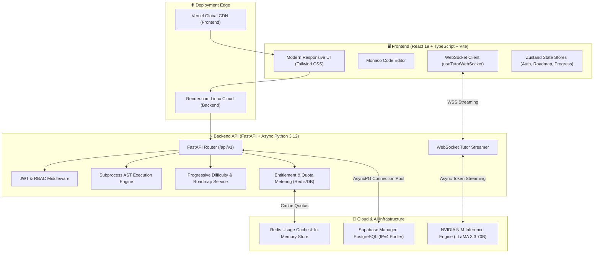
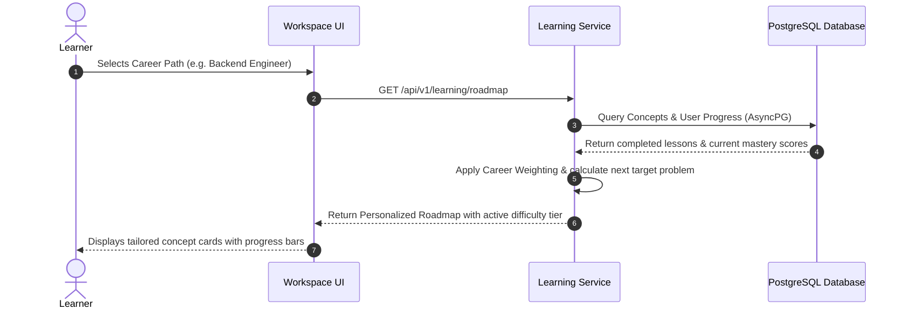
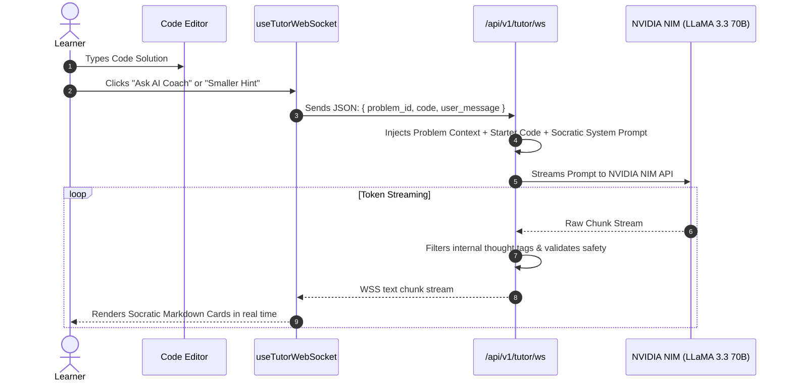
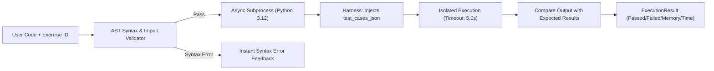
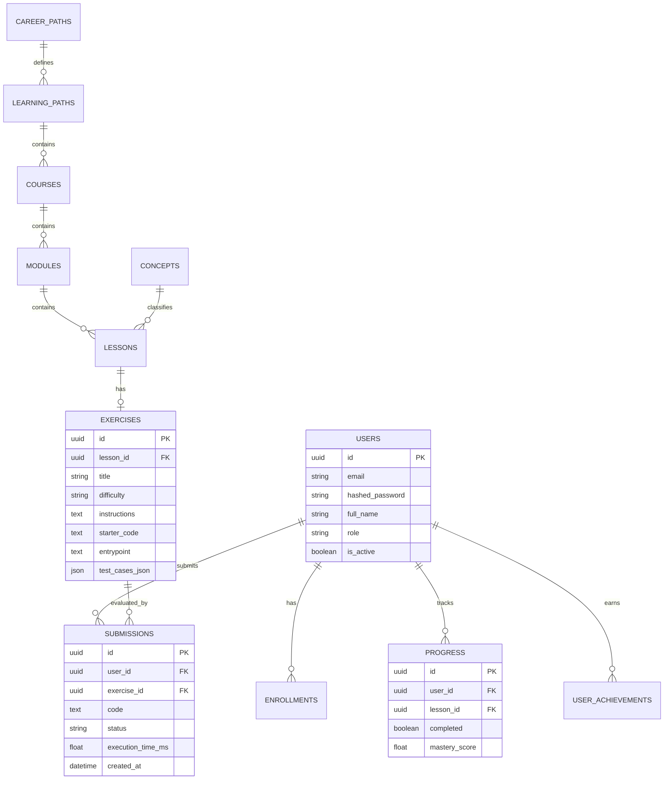

# 🎓 DSA AI Coach — Master Architecture & Presentation Guide

> **A Comprehensive Technical Deep-Dive, Architecture Blueprint, and Demo Guide for Judges, Evaluators, and Engineering Teams.**

---

## 📑 Table of Contents
1. [Executive Summary & 30-Second Pitch](#1-executive-summary--30-second-pitch)
2. [The Core Problem & Market Need](#2-the-core-problem--market-need)
3. [High-Level System Architecture](#3-high-level-system-architecture)
4. [Key Innovation Pillars](#4-key-innovation-pillars)
5. [Deep Dive: Core Engines & Data Flows](#5-deep-dive-core-engines--data-flows)
   - 5.1 [Career-Aligned Roadmap & Progressive Difficulty Engine](#51-career-aligned-roadmap--progressive-difficulty-engine)
   - 5.2 [Socratic AI Tutoring Architecture (NVIDIA NIM & LLaMA 3.3 70B)](#52-socratic-ai-tutoring-architecture-nvidia-nim--llama-33-70b)
   - 5.3 [Isolated AST Code Execution Sandbox](#53-isolated-ast-code-execution-sandbox)
   - 5.4 [Entitlement, Quota, & Multi-Tenant Billing Subsystem](#54-entitlement-quota--multi-tenant-billing-subsystem)
6. [Complete Tech Stack Breakdown](#6-complete-tech-stack-breakdown)
7. [Database Schema & Entity Relationship](#7-database-schema--entity-relationship)
8. [Live Demonstration Script (Step-by-Step Walkthrough)](#8-live-demonstration-script-step-by-step-walkthrough)
9. [Technical Q&A Cheat Sheet for Evaluators & Judges](#9-technical-qa-cheat-sheet-for-evaluators--judges)

---

## 1. Executive Summary & 30-Second Pitch

### 💡 The 30-Second Elevator Pitch
> *"Traditional DSA platforms like LeetCode present a one-size-fits-all grid of 3,000 disconnected problems with zero guidance, leading to tutorial hell and memorization instead of real algorithmic problem solving. **DSA AI Coach** is an AI-native learning platform that dynamically builds career-personalized curriculums (Backend, ML/AI, Frontend, Systems) and provides a **real-time Socratic AI Coach** powered by NVIDIA NIM. Instead of spoiling the code, our AI evaluates the learner's live AST and code state to deliver structured, cognitive micro-hints, probing questions, and edge-case insights that foster true first-principles mastery."*

---

## 2. The Core Problem & Market Need

| Traditional Platforms (LeetCode, HackerRank) | DSA AI Coach Solution |
| :--- | :--- |
| **Randomized Grinding**: Users blindly jump between random problems without a career objective. | **Role-Specific Pathways**: Re-ranks and weights algorithms for specific roles (e.g., Graphs/Concurrency for Backend; Matrix/DP for ML; Trees/Tries for Systems). |
| **The "Give Me the Code" Trap**: LLM chat widgets paste full solutions, ruining learning retention. | **Strict Socratic Guardrails**: Multi-tier prompting architecture delivers 3 distinct pedagogical blocks (Observation, Probing Question, Actionable Hint) without spoiling code. |
| **Passive Consumption**: Learners get stuck on a bug and quit or look at discussion solutions. | **Interactive Quick-Inquiry Chips**: 1-click targeted queries (`💡 Smaller Hint`, `🛡️ Edge Cases`, `⏱️ Complexity`) that reduce cognitive friction. |
| **Static Difficulty**: Problems don't adapt to learner ability. | **Adaptive Progression**: Deterministic mastery scoring promotes users from Easy ➔ Medium ➔ Hard as their genuine comprehension increases. |

---

## 3. High-Level System Architecture



---

## 4. Key Innovation Pillars

### 1. Dynamic Career Roadmaps
Rather than forcing every student to start with linked lists and end with 2D dynamic programming, learners select their target career path:
* **Backend Engineer**: Prioritizes Hash Maps, Graph Traversals (BFS/DFS), Trees, Caching Algorithms, and Concurrency.
* **ML / Data Science**: Prioritizes Matrix Manipulations, Vector Math, Dynamic Programming, and Topological Sorting.
* **Frontend Engineer**: Prioritizes Array manipulations, String parsing, Tree structures (DOM emulation), and Event queue simulations.
* **Systems / Core**: Prioritizes Bit Manipulation, Memory pointers, Binary Search, and Heaps.

### 2. Guardrailed Socratic AI Coach
Powered by **NVIDIA NIM** running `meta/llama-3.3-70b-instruct`:
* **Zero Chain-of-Thought Leakage**: System prompts and output token cleaners strip internal `<thought>` tags to keep the UI clean.
* **Pedagogical 3-Card Output**: Formats advice into:
  1. 💡 **Observation**: What the coach notices in the student's current logic.
  2. 🎯 **Probing Question**: A question that prompts the student to identify the flaw themselves.
  3. ⚡ **Actionable Hint**: A small, concrete next step to try.
* **Quick Inquiry Chips**: Instant chips for `💡 Smaller Hint`, `🛡️ Edge Cases`, and `⏱️ Time & Space Complexity`.

### 3. Real Python AST & Subprocess Sandbox
* Code is not sent to an external third-party execution API; it runs in a sandboxed asynchronous Python subprocess with CPU timeout limits and AST safety validation.
* Tests are verified against sample test cases (`Run`) and hidden regression test cases (`Submit`).

### 4. Deterministic Progressive Mastery
* Automatically calculates mastery percentage for concepts (`Arrays`, `Two Pointers`, `Sliding Window`, `Dynamic Programming`, etc.).
* Calculates pass rates, tracks submission history, and promotes the learner to harder problems when mastery crosses target thresholds.

---

## 5. Deep Dive: Core Engines & Data Flows

### 5.1 Career-Aligned Roadmap & Progressive Difficulty Engine



1. **Weighting Table**: Each career path maps to concept importance multipliers (1.0x to 2.5x).
2. **Mastery Calculation**: 
   $$\text{Mastery \%} = \frac{\text{Passed Exercises in Concept}}{\text{Total Curated Exercises in Concept}} \times 100$$
3. **Smart Promotion**: If a user maintains $>80\%$ pass rate on Easy problems for a concept, the engine recommends Medium problems. If they fail consecutive submissions, it serves a foundational concept review.

---

### 5.2 Socratic AI Tutoring Architecture (NVIDIA NIM & LLaMA 3.3 70B)



#### The Socratic Guardrail System Prompt:
```text
You are an expert DSA Coach. Your goal is to guide the student toward the solution using the Socratic method.
RULES:
1. NEVER provide the direct code solution.
2. Structure your response into exactly three concise blocks:
   - 💡 Observation: What you see in their code.
   - 🎯 Probing Question: A question guiding them to the missing piece.
   - ⚡ Actionable Hint: A minimal hint to unblock them.
3. Keep each block under 2 sentences.
```

---

### 5.3 Isolated AST Code Execution Sandbox



* **Timeout Protection**: Strict 5.0-second execution timeout prevents infinite loops (`while True: pass`).
* **Memory & Time Benchmarking**: Measures wall-clock execution time in milliseconds and memory usage in KB.
* **Test Case Assertions**: Safely evaluates array outputs, pointers, dictionary lookups, and graph adjacency structures.

---

### 5.4 Entitlement, Quota, & Multi-Tenant Billing Subsystem

* **Dual Storage**: Checks active subscriptions in PostgreSQL (`free`, `pro`, `enterprise`) and caches daily usage in Redis counters (`quota:<user_id>:<resource>:daily:<date>`).
* **Safe Fallbacks**: If Redis is offline, seamlessly falls back to direct database count checks without breaking user workflows.
* **Presentation Quota**: Configured with a generous 1,000 AI Coach requests/day to guarantee smooth presentation demos without rate limit interruptions.

---

## 6. Complete Tech Stack Breakdown

### Frontend
* **Core**: React 19, TypeScript, Vite.
* **Styling & UI**: Tailwind CSS, Lucide React icons, Custom Socratic Micro-Cards.
* **Code Editor**: Monaco Editor (`@monaco-editor/react`) with syntax highlighting, line wrapping, and dark mode.
* **State Management**: Zustand stores with persistent localStorage caching for authentication state.
* **Networking**: Native Fetch API with auto-bearer auth headers + native HTML5 WebSocket client.

### Backend
* **Runtime & Framework**: Python 3.12, FastAPI (high-concurrency async ASGI framework), Uvicorn.
* **ORM & Database Client**: SQLAlchemy 2.0 (Async Declarative Models), Alembic (Versioned schema migrations), `asyncpg` (C-optimized PostgreSQL driver).
* **AI & LLM Integration**: OpenAI Python SDK connecting to **NVIDIA NIM** (`meta/llama-3.3-70b-instruct`).
* **Security & Auth**: JWT (JSON Web Tokens) with HS256 algorithm, OAuth2 Password Bearer flow, `passlib` with `bcrypt` password hashing.
* **Code Execution**: Python AST verification, isolated asynchronous subprocesses with POSIX process group isolation and process kill timeouts.

### Cloud & Database Infrastructure
* **Frontend Hosting**: **Vercel** (Global Edge CDN, automatic build previews, zero-config SPA routing).
* **Backend Hosting**: **Render.com** (Linux Cloud Container, automatic HTTPS, WSS WebSocket streaming).
* **Database**: **Supabase Managed PostgreSQL** connected via high-throughput IPv4 Connection Pooler (`aws-0-....pooler.supabase.com:5432`).
* **AI Inference**: **NVIDIA NIM API** (`integrate.api.nvidia.com/v1`) running enterprise-grade 70B parameter models.

---

## 7. Database Schema & Entity Relationship



---

## 8. Live Demonstration Script (Step-by-Step Walkthrough)

Use this step-by-step script when presenting the live project to evaluators:

### 🎬 Scene 1: Landing & Login (15 seconds)
* **Action**: Open the live link **`https://dsa-ai-coach.vercel.app`**.
* **Presenter says**: 
  > *"Welcome to DSA AI Coach. We designed this platform to bridge the gap between traditional rote memorization and true algorithmic problem solving. Let's log in."*
* **Action**: Log in with demo credentials or sign up with a new account.

---

### 🎬 Scene 2: Personalized Career Dashboard & Roadmap (30 seconds)
* **Action**: Navigate to **Learn / Roadmap**.
* **Presenter says**: 
  > *"Notice how the curriculum is organized by Career Pathway. A Backend Engineer gets a structured roadmap focusing on Hash Maps, Trees, Graphs, and Concurrency, whereas an ML student gets Matrix, Dynamic Programming, and Topological sort. The system tracks granular concept mastery percentage and dynamically suggests the next optimal challenge."*

---

### 🎬 Scene 3: Problem Workspace & Monaco Editor (30 seconds)
* **Action**: Click on **"Two Sum"** or any problem from the Problems list.
* **Presenter says**: 
  > *"Here in our problem workspace, we have a complete IDE experience powered by the Monaco editor—the exact same engine that powers VS Code. On the left, we have clear problem statements and constraints. On the right, we have our real-time Test Results and our AI Coach."*

---

### 🎬 Scene 4: Socratic AI Tutoring in Action (The "Wow" Moment) (45 seconds)
* **Action**: Leave the starter code incomplete, click the **"AI Coach"** tab, and click **"Ask AI Coach"** (or click **"💡 Smaller Hint"**).
* **Presenter says**: 
  > *"Watch what happens when I ask for help. Notice that the AI does NOT just dump the solution code. Instead, powered by NVIDIA NIM's LLaMA 3.3 70B model with strict Socratic guardrails, it analyzes my code and gives me three punchy, digestible cards: an Observation, a Probing Question, and an Actionable Hint. It teaches me to think algorithmically rather than copy-pasting."*

---

### 🎬 Scene 5: Code Execution & Instant Feedback (30 seconds)
* **Action**: Write the optimal Hash Map solution:
  ```python
  def twoSum(nums, target):
      seen = {}
      for i, num in enumerate(nums):
          comp = target - num
          if comp in seen:
              return [seen[comp], i]
          seen[num] = i
      return []
  ```
* **Action**: Click **"Run"** (shows test cases passing), then click **"Submit"**.
* **Presenter says**: 
  > *"When I click Submit, the code runs in our isolated sandboxed runtime. The tests pass, our submission is recorded in Supabase, our Concept Mastery score increases, and the platform automatically unlocks the next step in our roadmap."*

---

## 9. Technical Q&A Cheat Sheet for Evaluators & Judges

### Q1: *"Why did you use NVIDIA NIM instead of standard OpenAI or generic LLMs?"*
> **Answer**: *"NVIDIA NIM provides ultra-low latency inference endpoints with dedicated hardware acceleration, which is critical for real-time WebSocket token streaming in a coding workspace. We use `meta/llama-3.3-70b-instruct` through NIM to achieve state-of-the-art reasoning on complex algorithm ASTs without paying prohibitive proprietary model costs."*

---

### Q2: *"How do you prevent the AI from giving away the full solution code?"*
> **Answer**: *"We implement a multi-layered guardrail: First, the system prompt strictly instructs the model to follow the Socratic method and forbids code blocks. Second, we use an output post-processor in Python that strips out chain-of-thought reasoning artifacts and parses the response into discrete pedagogical blocks (Observation, Probing Question, Actionable Hint). Third, our frontend `CoachMarkdown` component converts these blocks into distinct micro-cards for clean readability."*

---

### Q3: *"How is user code safely executed?"*
> **Answer**: *"Submissions are passed through an AST validator to check for illegal imports or dangerous system calls. The code is then executed in an isolated asynchronous Python subprocess with hard timeout constraints (5.0s max execution) and strict memory thresholds. Test cases are dynamically injected and verified in-process."*

---

### Q4: *"How does the system handle high concurrency and traffic?"*
> **Answer**: *"The backend is built entirely on asynchronous I/O using FastAPI, Uvicorn, and SQLAlchemy with `asyncpg` connection pooling to Supabase PostgreSQL. WebSocket connections are managed asynchronously, allowing a single lightweight container to maintain hundreds of concurrent streaming tutoring sessions with minimal CPU and memory overhead."*

---

### Q5: *"How is user progress and mastery calculated?"*
> **Answer**: *"Mastery is deterministic and multi-factored. It is not just a binary count of solved questions. We track pass rates, submission frequency, and problem difficulty (Easy, Medium, Hard). As a learner consistently passes problems in a topic with high pass rates, their mastery score climbs, unlocking harder challenges and updating their career roadmap readiness score."*

---

## 🏁 Summary Checklist for the Presentation

- [x] **Frontend URL**: `https://dsa-ai-coach.vercel.app`
- [x] **Backend URL**: `https://dsa-ai-coach-backend.onrender.com`
- [x] **Database**: Supabase Managed PostgreSQL (IPv4 Pooler)
- [x] **AI Model**: NVIDIA NIM (`meta/llama-3.3-70b-instruct`)
- [x] **Demo Login**: `demo@kalvium.com` / `DemoPassword123!` (or create any new user)
- [x] **Key Highlight**: Socratic AI micro-cards & career-aligned algorithmic roadmaps!
